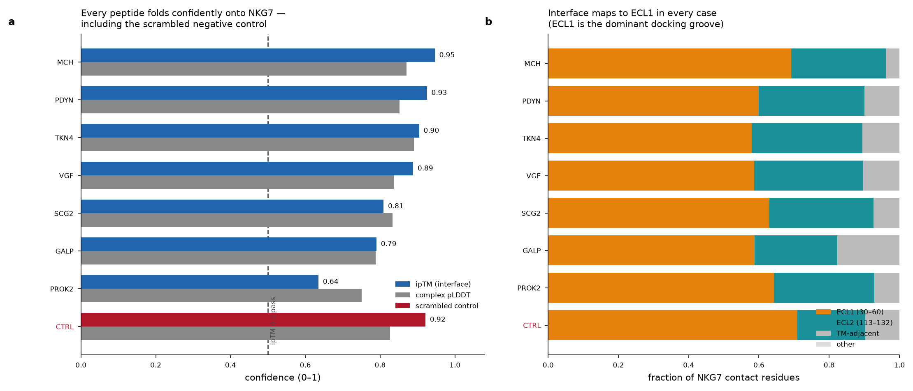
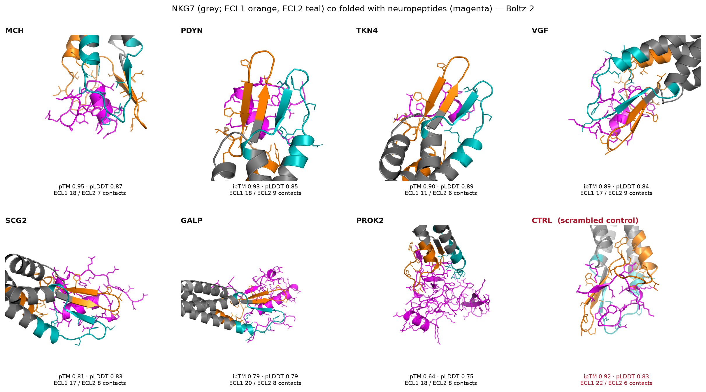

# NKG7 × neuropeptide binding — integrated report

**Prepared for:** Susanna Ng / A. Loukas Lab collaboration (grant P1_NKG7)
**Compute:** marvin HPC (SLURM, NVIDIA A40)
**Software:** Boltz-2 v2.2.1; OpenMM 8.2 + AmberTools 24 (ff14SB, GBn2)

---

## 1. Background and question

The Alex Loukas lab (Connor McHugh, AITHM/JCU) screened the full human secretome
against the two NKG7 extracellular-loop peptide sequences with **AlphaFold-Multimer
(AFM)** and nominated a set of neuropeptides as candidate **NKG7** binders. Those
hits passed the screen's contact filter (LIS/LIA) but sat at the **bottom** of the
AFM confidence ranking (ipTM ≈ 0.27–0.49) — plausible but weak.

**Question for this workflow:** does an independent structure predictor reproduce a
consistent NKG7-binding mode for these neuropeptides, and can we distinguish genuine
binding from the general "stickiness" of the NKG7 loops?

## 2. Methods primer (plain language)

**NKG7** is a small four-transmembrane (4-TM) membrane protein. Its two extracellular
loops — **ECL1 (residues 30–60)** and **ECL2 (residues 113–132)** — are the only parts
a secreted peptide could contact from outside the cell, so they are the target surface.

**Co-folding (Boltz-2).** Boltz-2 is an open structure predictor (an AlphaFold3-class
model) that, given two sequences, predicts the 3-D structure of the *complex*. We use it
as an **orthogonal cross-check** to the Loukas AFM screen — a second, mechanistically
independent method looking at the same question.

**ipTM (interface predicted TM-score, 0–1).** The model's own confidence that the
*interface between the two chains* is correct. > 0.5 is the conventional "the model
thinks these two things form an interface" threshold. **ipTM is a geometric confidence
score, not a binding energy** — a high ipTM says the model can place the peptide on the
receptor confidently, not that the pair binds tightly or specifically in reality.

**MM/GBSA — Molecular Mechanics / Generalized Born Surface Area.** A physics-based
estimate of **binding free energy** (ΔG_bind): how energetically favourable it is for the
peptide and NKG7 to be bound versus free in solution. It combines (i) *molecular
mechanics* force-field energy (bonds, angles, torsions, van der Waals, electrostatics;
here Amber **ff14SB**), (ii) *Generalized Born* implicit solvent — water treated as a
continuum to estimate the electrostatic cost of desolvation on binding, and (iii) a
*surface-area* term for the hydrophobic contribution. The estimate is computed as

> ΔG_bind ≈ ⟨E_complex⟩ − ⟨E_receptor⟩ − ⟨E_peptide⟩   (averaged over short-MD snapshots)

**Caveat (stated up front):** single-trajectory MM/GBSA omits configurational entropy
(−TΔS) and uses approximate implicit-solvent electrostatics, so the number is **not an
absolute Kd**. It is a **relative ranking tool** — meaningful *within* this run and
*against the scrambled controls*, not as an absolute affinity. This is the same footing
used in the sister `ligand_cofold` (p-cresol-sulfate) workflow.

**Scrambled controls (the specificity test).** The core risk is that NKG7's loops accept
*any* short peptide. To test this we co-fold **sequence-shuffled decoys** — identical
amino-acid composition, biological motif destroyed. If a real peptide scores no better
than its own shuffles, its confident co-fold is not evidence of specific binding. Several
independent shuffles per peptide give a **null distribution**, against which each real
peptide gets a **z-score**.

## 3. Inputs

**Receptor:** human NKG7 (UniProt Q16617, 165 aa), full length. Sequence and loop
definitions cross-verified four ways (UniProt topology; Loukas "Alex NKG7 extracellular
domains" pptx; the local NKG7 minibinder campaign config; the AF model staged on marvin) —
all agree. TM helices 9–29 / 61–81 / 92–112 / 133–153 ⇒ ECL1 = 30–60, ECL2 = 113–132.

**Peptides:** mature bioactive forms (from UniProt processed-peptide features), `inputs/peptides.csv`:

| ID | Peptide | UniProt | Mature range | Length |
|----|---------|---------|--------------|--------|
| PROK2 | prokineticin-2 | Q9HC23 | 28–129 | 102 |
| PDYN | dynorphin A(1-17) | P01213 | 207–223 | 17 |
| MCH | melanin-concentrating hormone | P20382 | 147–165 | 19 |
| GALP | galanin-like peptide | Q9UBC7 | 25–84 | 60 |
| VGF | VGF TLQP-21 | O15240 | 554–574 | 21 |
| TKN4 | tachykinin-4 / neurokinin-B | Q9UHF0 | 81–90 | 10 |
| SCG2 | secretoneurin | P13521 | 182–214 | 33 |

MCH modelled with its native Cys7–Cys16 disulfide (explicit bond constraint).

## 4. Co-folding results

Each NKG7+peptide pair predicted with Boltz-2 (`--recycling_steps 3
--diffusion_samples 5 --use_msa_server`; real MSAs confirmed — this is a native
receptor, not a de novo binder). Top model (`model_0`) carried forward. Heavy-atom
contacts counted at 4.5 Å; each contacted NKG7 residue assigned to ECL1 / ECL2 / TM /
other.

**Ranked by ipTM** (`results/nkg7_neuropeptide_ranked.csv`):

| ID | Peptide | ipTM | complex pLDDT | pTM | conf. | ECL1 | ECL2 | Loop |
|----|---------|------|------|-----|-------|------|------|------|
| MCH | melanin-concentrating hormone | **0.95** | 0.87 | 0.94 | 0.89 | 18 | 7 | ECL1 |
| PDYN | dynorphin A(1-17) | **0.93** | 0.85 | 0.94 | 0.87 | 18 | 9 | ECL1 |
| _CTRL_ | _scrambled dynorphin-A_ | _0.92_ | _0.83_ | _0.94_ | _0.85_ | _22_ | _6_ | _ECL1_ |
| TKN4 | tachykinin-4 / neurokinin-B | 0.90 | 0.89 | 0.94 | 0.89 | 11 | 6 | ECL1 |
| VGF | VGF TLQP-21 | 0.89 | 0.84 | 0.92 | 0.85 | 17 | 9 | ECL1 |
| SCG2 | secretoneurin | 0.81 | 0.83 | 0.90 | 0.83 | 17 | 8 | ECL1 |
| GALP | galanin-like peptide | 0.79 | 0.79 | 0.88 | 0.79 | 20 | 8 | ECL1 |
| PROK2 | prokineticin-2 | 0.64 | 0.75 | 0.80 | 0.73 | 18 | 8 | ECL1 |

*Renders: NKG7 grey; ECL1 orange; ECL2 teal; TM helices dark grey; peptide magenta;
interface side chains as sticks.*

**ECL1 is the shared docking site.** Every peptide — and the scrambled control — engages
a common ECL1 surface. Nine ECL1 residues are contacted in **all eight** complexes:
**A31, H36, A38, H39, S40, P44, T45, D49, Y54** (with W43, I50, S52 in most). A secondary
ECL2 rim (P120, H122, I125, T127) is present but never dominates. Several peptides (PDYN,
TKN4, SCG2, VGF) form a short β-strand that pairs antiparallel with the ECL1 backbone;
MCH docks its disulfide-closed helix-loop into the ECL1/ECL2 cleft.

## 5. The specificity finding

The scrambled dynorphin-A control reproduces the real peptides' behaviour almost
exactly: **ipTM 0.92, the same ECL1 residues, the same loop assignment** — out-scoring
five of the seven real peptides. Therefore:

1. **NKG7 ECL1 is a promiscuous, "sticky" peptide-binding groove.** A confident Boltz-2
   co-fold is expected for almost any short cationic/amphipathic peptide, so high ipTM
   here is **not** evidence of a genuine physiological ligand.
2. The Boltz-2 result is best reported as an **orthogonal cross-check that reproduces a
   consistent binding *site*** (corroborating the ECL1 region the AFM screen implicated),
   not as validation of individual peptide identities.
3. **The meaningful readout is each real peptide vs its own scrambles.** On the single
   control so far, only **MCH** and **PDYN** clearly beat it.

## 6. Specificity expansion (in progress)

To put the specificity test on a statistical footing, two analyses extend this report:

- **Null ipTM distributions** — 5 independent shuffles per peptide, co-folded the same
  way, giving a per-peptide null and a z-score for the real peptide. → `results/`
- **Peptide MM/GBSA rescoring** — physics-based ΔG_bind for every complex + controls, to
  test whether *binding energy* separates real peptides from decoys where ipTM cannot.
  → `results/`, `pipeline/mmgbsa_peptide.py`

*(This section and its figures are populated when those jobs complete.)*

## 7. Wet-lab recommendations

- Prioritise **MCH** and **PDYN** — the only peptides that beat the composition-matched
  control — for experimental follow-up (competition binding; the NKG7-KO NK killing assay
  with PROK2 / dynorphin-A already planned).
- Treat all ipTM-based rankings as **hypothesis-generating**, not confirmatory: the
  scrambled control shows the assay's confident-by-default failure mode.

## 8. Files

- `results/nkg7_neuropeptide_ranked.csv` — confidence + contact table (8 complexes)
- `results/contacts_detail.json` — per-complex contacted-residue lists
- `figures/summary_panel.png`, `figures/complex_gallery.png`, `figures/complex_<ID>.png`
- `structures/NKG7_<ID>.pdb` — co-fold coordinates (chain A = NKG7, chain B = peptide)
- `pipeline/` — YAML render, interface analysis, PyMOL render, peptide MM/GBSA
- `envs/` — marvin conda env specs + build gotchas
